# xiaoquduodaka
Fiddler不在此仓库中提供，请自行寻找下载渠道！

一次配置持久使用的校趣多打卡方案

预备工作：一个QQ邮箱，一个腾讯云账号（腾讯云官网链接https://cloud.tencent.com/）

第一步：打开腾讯云官网，等录后，在搜索框内输入【云函数】回车

第二步：点击进入管理控制台

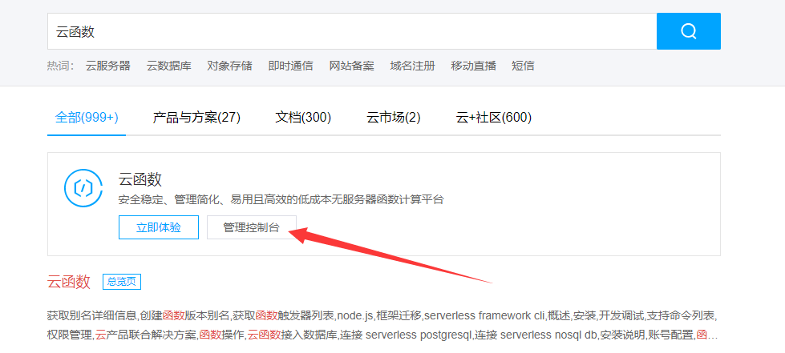

第三步：完成实名认证（详细步骤请按照网站要求进行，此处省略）

第四步：依次点击【函数服务】和【新建】

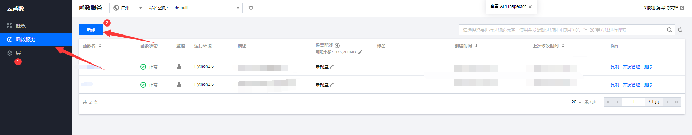

第五步：选择【自定义】，更改名字，选择【Python3.6】，去掉多余字符

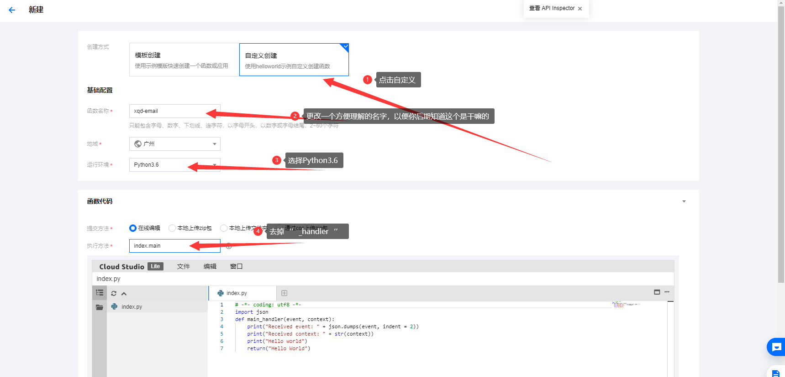

第六步：打开【代码.txt】，你需要修改的只有红框当中的四个位置

【openid】：下一步详细讲解如何获取

【Username】：填写你的用于接收打卡成功反馈的QQ邮箱

【pasd】：填写你获得的QQ邮箱smtp授权码，详细步骤见https://jingyan.baidu.com/article/6079ad0eb14aaa28fe86db5a.html

【phone】：你的手机号

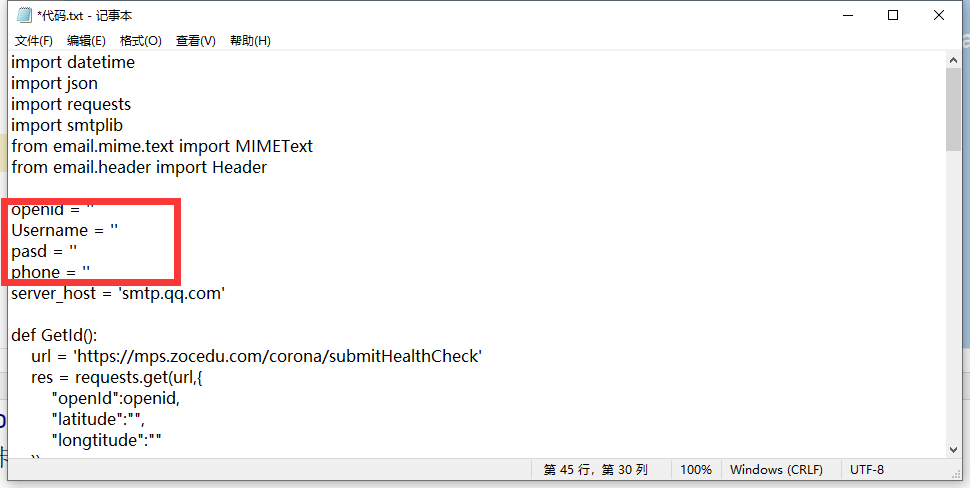

第七步：openid的获取方式

打开电脑端微信，手机扫码登陆，解压压缩包【Fiddler_v5.0.20194.41348.rar】

打开【Fidder.exe】

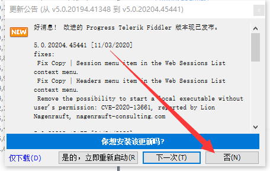

拒绝更新,打开解码功能

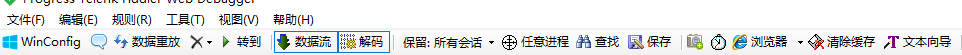

然后注意打开解密功能，【工具】 【选项】 【HTTPS】 勾选【解密HTTPS流量】，按照提示，同意弹出的对话框，然后重启fiddler

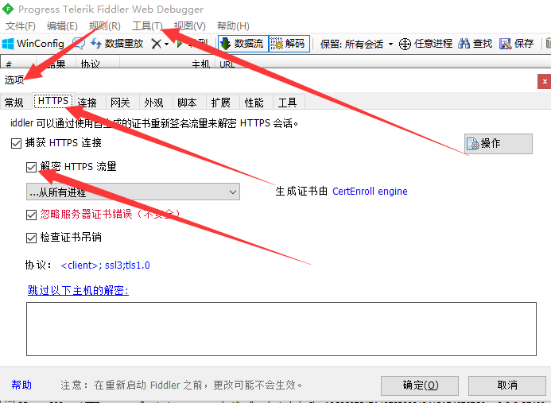

微信端打开校趣多小程序，并进行一次打卡

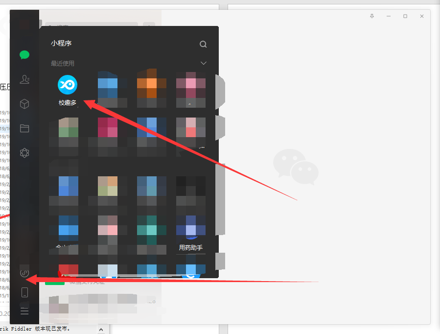

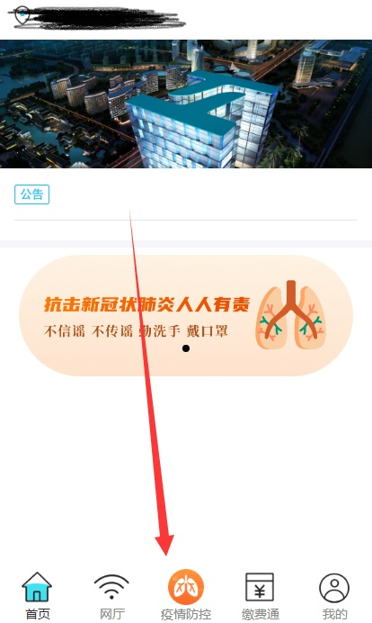

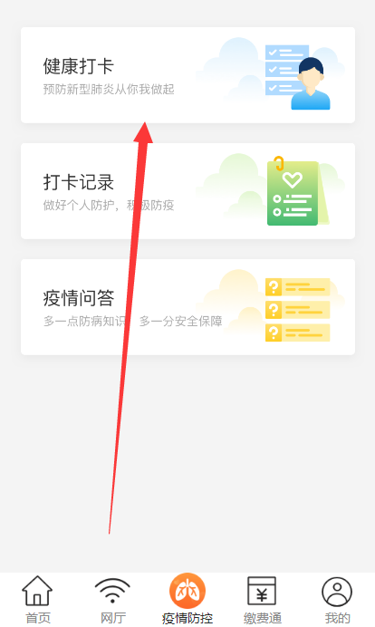

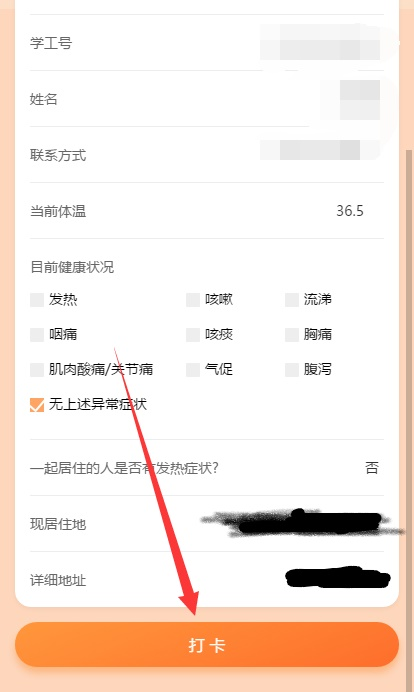

显示打卡成功后，返回fiddler操作界面找到蓝色字体，主机地址为【mps.zocedu.com】，并且url为【/corona/submitHealthCheck?openId=*****&latitude=&longitude= HTTP/1.1】的数据，双击打开，点击【Webforms】然后复制openid的值，粘贴到代码当中去即可

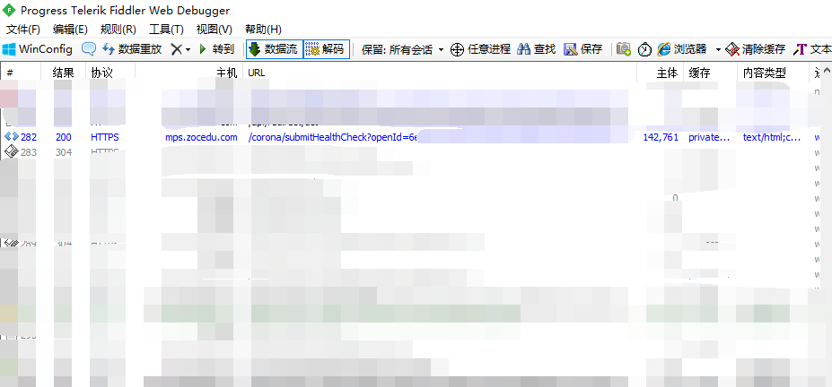

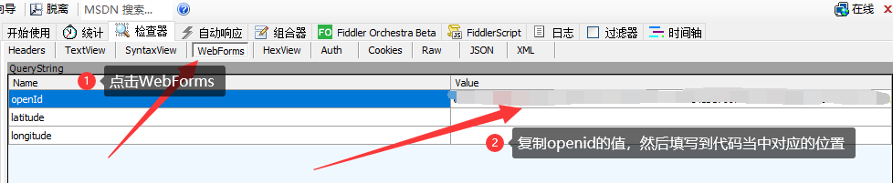

第八步：打开浏览器，进入云函数控制台，将修改之后的代码，复制替换原内容

 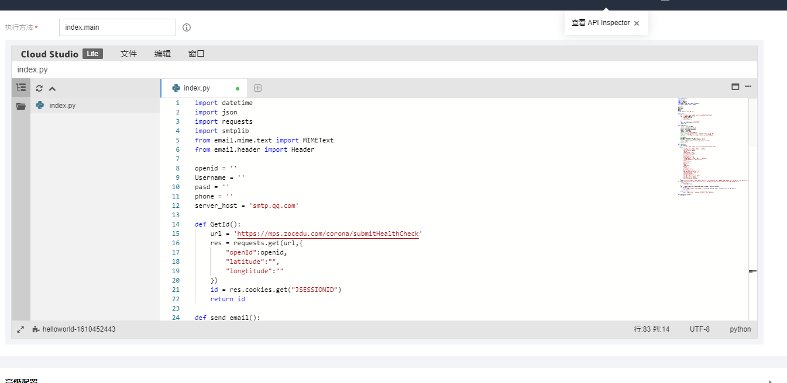

第九步：设置自动触发

 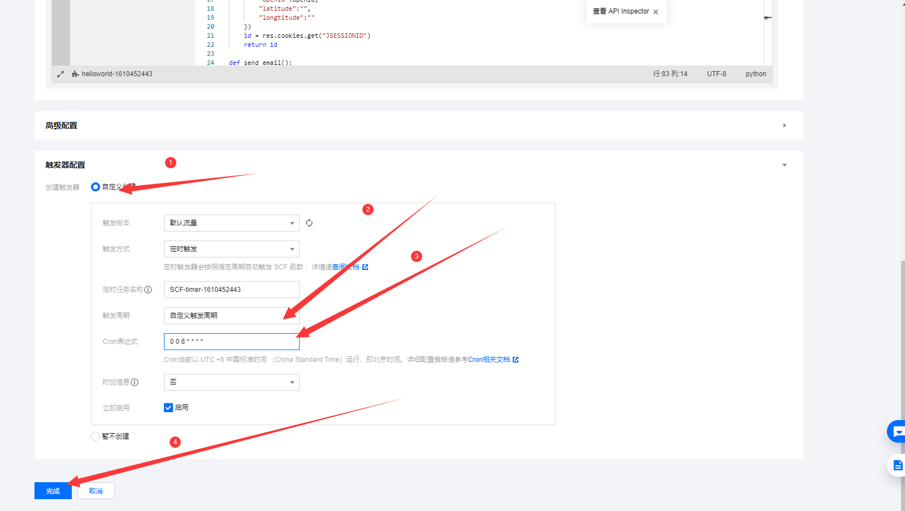

完成后进行下一步

第十步：进行测试

 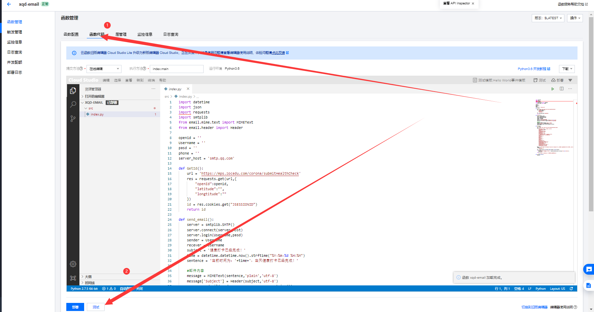

如果你的邮箱收到了反馈邮件，证明操作成功

 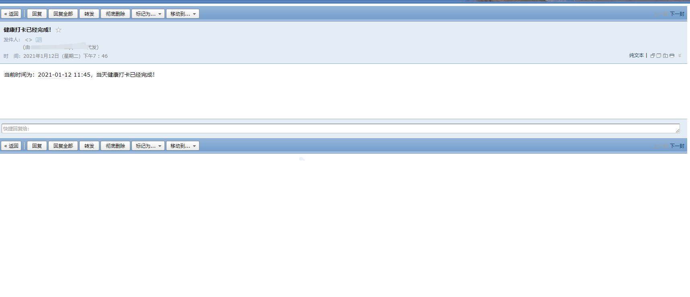
